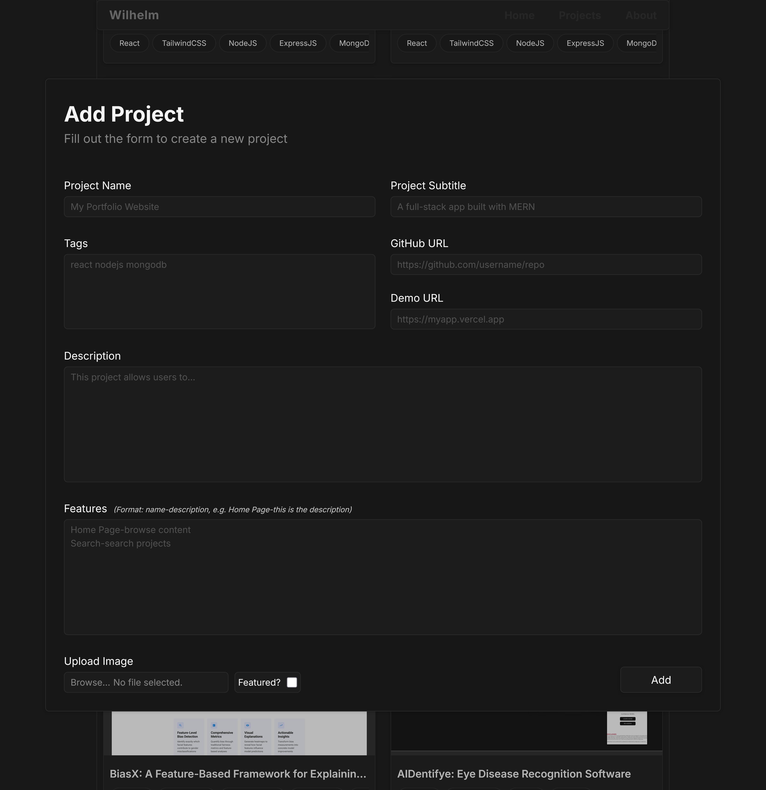

# Portfolio  

**A React-based personal portfolio with a built-in project showcase and lightweight project manager**  

This portfolio highlights my skills, projects, and experience as an aspiring full-stack developer with a touch of AI. It features a clean UI for presenting personal info, tech stack, and featured work, along with a simple tool for managing showcased projects. Built with **React (frontend)**, **Node.js + Express (backend)**, and **MongoDB (database)**.  

  

## ✨ Features  

### **Home**  
Quick overview of my name, contact info, experience, tech stack, and featured projects.  
  

### **Projects**  
Browse all projects with details on the technologies used.  
  

### **About**  
More personal details: profile, location, education, seminars, and workshops.  
  

### **Project Preview**  
View project details: description, tech stack, GitHub/demo links, and key features.  
  

### **Project Manager**  
Extra functionality for adding, editing, and deleting projects in the portfolio.  
  

- **Add Project** – Add new project details to be showcased.  
    

- **Edit Project** – Update, modify, or delete existing project information.  
    

---
